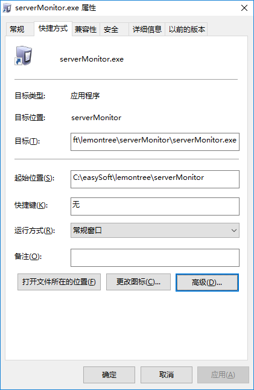
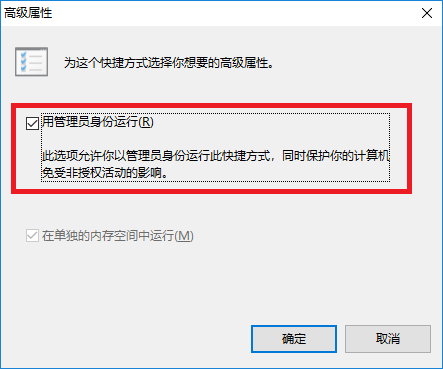

---
html:
  embed_local_images: true
  embed_svg: true
  offline: true

export_on_save:
  html: true
---

# 综合服务器提示 8888 端口被占用

## 问题现象

> - 综合服务器提示 8888 端口被占用
> - 楼面机显示软件未注册

## 问题原因

> Windows10 对系统权限做了增强，一般软件不允许启动系统服务，而我们的注册服务器是作为系统服务运行的，如果没有管理权限的话，综合服务器就自动不了。

## 解决方法

> - 右键点击桌面上的综合服务器图标，选择属性，然后点击高级

> - 选择“用管理员身份运行”

> - 按上述的步奏操作完之后还是提示被占用；关闭综合服务器，打开任务管理器，找“tomcat7.exe”进程是否还在运行，如有结束该进程，再次打开综合服务器。

