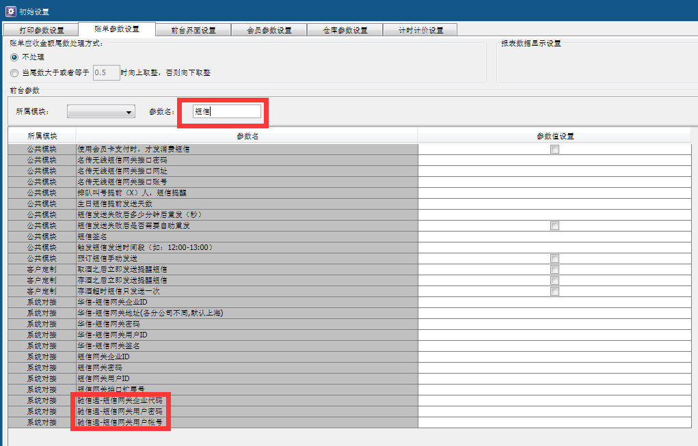
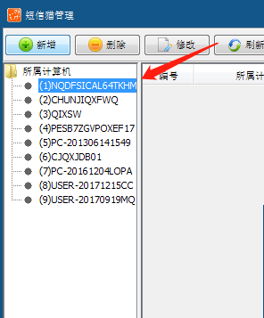
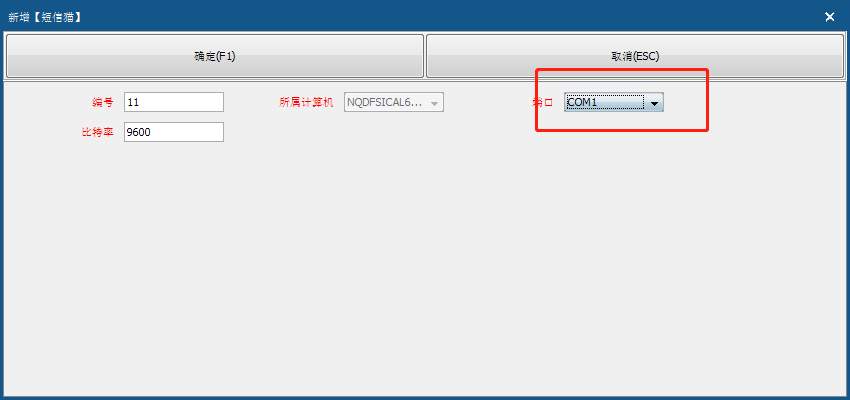
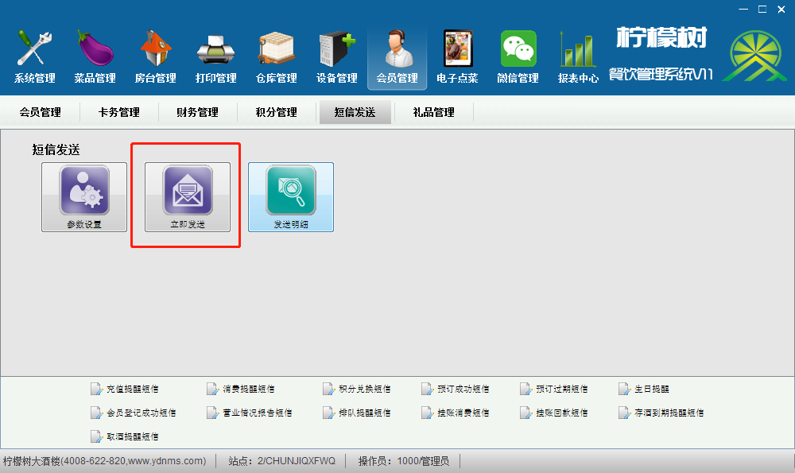
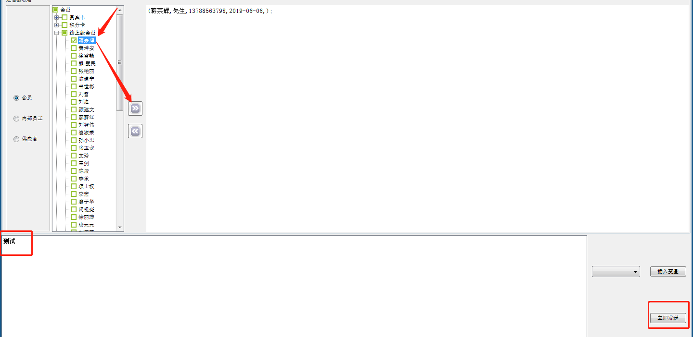
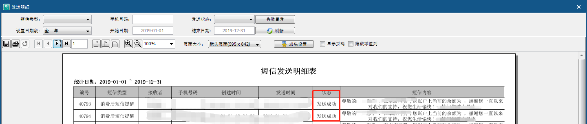

---
html:
  embed_local_images: true
  embed_svg: true
  offline: true

export_on_save:
  html: true
---
 # 驰信通短信设置

> - 登录后台>初始设置>账单参数>搜索“短信”
填上对应的账号密码 （！！！不要填错信息！！！） 

> - 设备管理>短信猫>选择主机“新增”
添加端口默认com1

> - 会员>短信管理>立即发生

> - 添加接收号码编辑需要发送的内容，点立即发送

> - 到发送明显，状态提示“发送成功即可”

短信发送成功尚未接收到短信，请耐心等候第一次使用需要工作人员后台报备